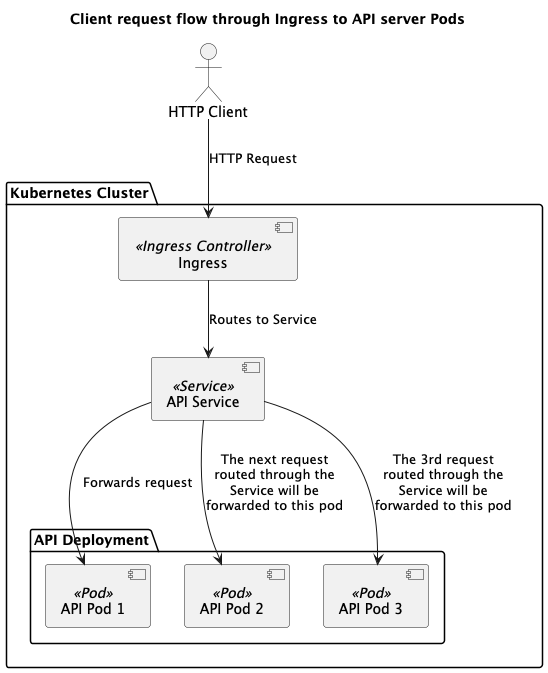

## Web application with `deploydocus2`

### The target deployment



### Pre-requisites

I assume you already have virtual environment created and `deploydocus2` installed <!-- TODO: link to pypi--> but if not, the following will do 

```shell
python3 -m venv .venv/example # create a new virtual environment
source .venv/example/bin/activate # activate the virtual environment
pip3 install deploydocus2
```

We are now ready for this script. 
I am going to use a bespoke container `python-jsonserver`

[](){ #code-basic-intro }
```python
# the script should run as-is
from deploydocus2.components.workloads import SimpleHttpApplication
from deploydocus2.pkg import K8sModelSequence
from deploydocus2.utils import render

app_install = SimpleHttpApplication(
                app_name='httpserver',
                version="1.0.0",
                namespace="httpserver",
                app_image="docker.io/pbhowmic/python-jsonserver:0.1",
                http_named_ports={'http':8080}
            )

rendered: K8sModelSequence = app_install.gen_k8s_components().render() # returns a sequence of Kubernetes objects
print(render(rendered, 'yaml'))
```

this renders us a complete Kubernetes YAML manifest. We can now apply this to a cluster of our choice using `kubectl`.

So far so good:

- Brevity is its own virtue.
- It provides a paved, fully functional way tp deploy your application.
- It required only one optional field to be overridden, the `http_named_ports`, because the application container listens on port 8080 instead of the default http port of 8000 defined in the Pydantic class.

### We can do one better though 
Why depend on `kubectl` to render the generated manifests? We can apply the manifests directly from `deploydocus2`. 

So continuing from [the previous code][code-basic-intro]

Assuming 
```python
from deploydocus2.components.workloads import SimpleHttpApplication
from deploydocus2.pkg import K8sModelSequence
from deploydocus2.utils import render
from kubernetes import configuration
from kubernetes.api_client import ApiClient, Configuration
app_install = SimpleHttpApplication(
                app_name='httpserver',
                version="1.0.0",
                namespace="httpserver",
                app_image="docker.io/pbhowmic/python-jsonserver:0.1",
                http_named_ports={'http':8080}
            )
cfg = configuration.Configuration('')
client = ApiClient(configuration=Configuration)

```
